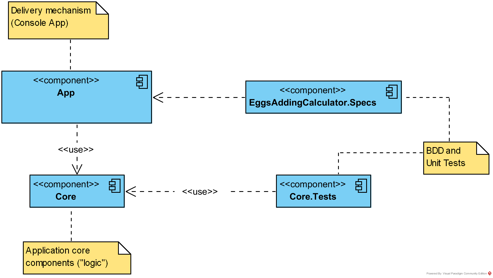

# Eggs Adding Calculator Project
This is a very simple package with a single component the `Calculator` (`Core.Calculator`). The intention of this project is not create the best calculator in the world. We want the simplest calculator in the world so we can focus on Test Driven Development (TDD) practices, specifically two of them Behavior Driven Development (BDD) and Unit Testing.

## BDD blocks: Given, When, Then (GWT)
Those blocks will be our "higher order" tests, meaning they should be as close to the Delivery Mechanism (a.k.a "the UI") as possible. So, ideally, if our calculator exposes a Web Interface, BDD tests should target that process and validate its behavior as if it was the user itself.

Due to low testability of some "UI" technologies, there is also not possible to test the outer most layer. So we can test against some component in the inner layers, but not as far as individual files and / or classes, because this could be considered a Unit Test.

To see examples of these blocks go to the project `EggsAddingCalculator.Specs` and look for `.feature` files.

## TDD blocks: Arrange, Act, Assert (AAA)
Those blocks will be our "lower order" tests. We don't have mid-level tests (such as integration, end-to-end, or components), we only have the lowest level possible: Unit Tests.

The AAA blocks will be implemented as individual test methods, decorated with `[Test]` or `[TestCase]`, within `Core.Tests` project. The selected organization of those test cases was taken from (almost a literal copy of) the article [Structuring Unit Tests](https://haacked.com/archive/2012/01/02/structuring-unit-tests.aspx/ "Structuring Unit Tests") by [Phil Haack](https://haacked.com/about/ "Phils Bio"). The structure is as follow:

* For every class (Subject Under Test - SUT), we should have a "Facts" collection about its public interface (messages).
* For each individual Message (C# method) we'll have a subclass called <MethodName>Message
* Within each *Message class will have several methods testing a particular scenario of the target SUT's Message

So, for example, if we have the `Calculator` class, with the Message `Add(addendA: int, addendB: int)` we should have at least the following structure within `Core.Tests` project:

* A `CalculatorFacts` class (test fixture)
  * `AddMessage` sub-class
      * One or more test methods for individual scenarios of the Add Message

Something like the following:
``` C#
    [TestFixture]
    public sealed class CalculatorFacts
    {
        public sealed class AddMessage
        {
            [TestCase(1, 1, 2, Description = "1 + 1 Should Be 2")]
            [TestCase(1, 2, 3, Description = "1 + 2 Should Be 3")]
            public void AddTwoNumbers(int addendA, int addendB, int expected)
            {
                //Arrange
                Calculator calc = new Calculator();

                //Act
                int actual = calc.Add(addendA, addendB);

                //Assert
                Assert.That(actual, Is.EqualTo(expected));
            }

            [Test]
            public void MaxValuePlusOneMustBeEqualsToMinValue()
            {
                //Arrange
                Calculator calc = new Calculator();

                //Act
                int actual = calc.Add(int.MaxValue, 1);

                //Assert
                Assert.That(actual, Is.EqualTo(int.MinValue));
            }
        }
    }
```
----

## The Technologies
This project uses two frameworks for test automation:

*  **For BDD** tests it uses [specflow](http://specflow.org/ "specflow home page"), a Gherkin parser for the .NET platform.
	*  To be consistent and reduce the learning curve the "Unit test provider" for specflow used is also NUnit
	*  This allow you to focus only in two frameworks not three or more
*  **For Unit Tests** it uses [NUnit 3.x](http://nunit.org/ "NUnit website"), a x-unit implementation, initially, a port of [JUnit](http://junit.org/junit5/ "JUnit website").
*  The selected delivery mechanism is the Console, so our calculator is **exposed as a Console Application**.

### .NET Framework related stuff

* **.NET Framework** Version 4.6.1
* **C# language** version 7
* This project uses **Nuget**, so after cloning this repository you should be able to running just by restoring all nuget packages for the solution.
* Built using **Visual Studio 2017** Enterprise, but it should work with the community version as well. 


----

## Components


1. `App` is the Console Application, it uses the Core to access the Calculator Class, directly, no Controller or other indirection.
2. `EggsAddingCalculator.Specs` contains the BDD related tests, it depend (run-time) on the console app, the tests are done by launching the `App.exe` program as a child process.
3. `Core.Tests` contains Unit Tests.
4. `Core` contains the application's "logic" (only the `Calculator` class).

----

## Next Steps
This little project serves to practice multiple topics, such as:
*  TDD with BDD frameworks
*  TDD with Unit Tests frameworks
*  TDD with both BDD and Unit Tests frameworks
*  Refactoring
*  Pair Programming
*  Mob Programming
*  Coding Dojo
*  Design artifacts creation, such as CRC cards, UML Diagrams, etc.
*  ...

No matter the topic you will be required to practice using this code base, ***you should first be familiar with the code and, at least:***
*  Fork the solution
*  Clone the solution into your workstation
*  Build the solution
*  Run all tests within IDE or console
*  Verify that all tests pass (are "Green")
*  Try to extend the actual Calculator's functionality

Then ask for further, in class or written, instructions.
